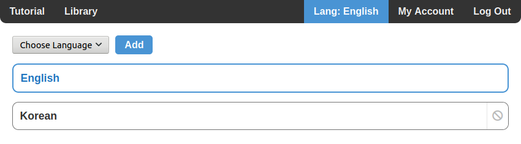
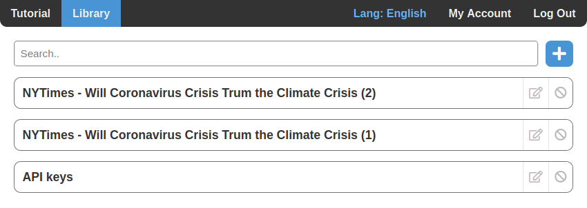
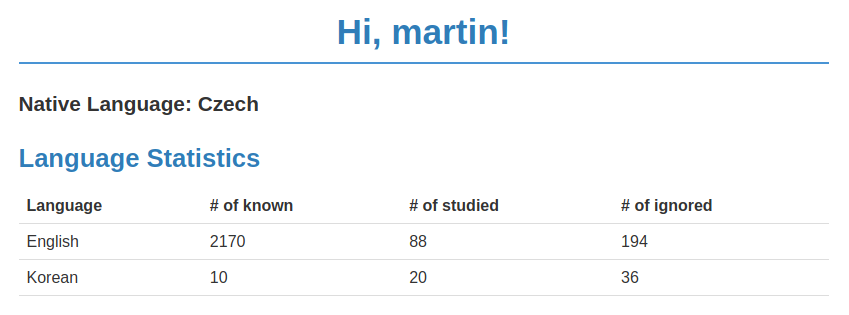

# LangReader.net

The language learning web application through reading.

The web application is developed using these technologies:

- frontend: **JavaScript** using the **React.js** framework,
**HTML**, **CSS**
- backend: **Java**, using **Spring Boot** and **Spring Security**
- persistance: **Spring Data JPA**, **PostgreSQL**
- server: AWS EC2 (Linux)

The frontend and backend communicate through a REST API.

### Functionality

After registering, you can add what languages you want to 
study through the languages page:

After adding your first language a section **Library** appears.
In the Library, you can add your own texts that you want to 
read:

After adding some texts, you can start reading:

In the screenshot above, you can see words I'm interested in
 studying in **yellow**, and whenever you mark words as studied,
 their translation into your native language appears above it.
 
 Words that haven't been encountered before are colored 
 **blue**.
 
 You can see statistics of words for your studied languages
 in the **My Account** section:
 
 
 
 You can find out more on how to use the website in the
 **Tutorial** section, which you'll see after creating an account.